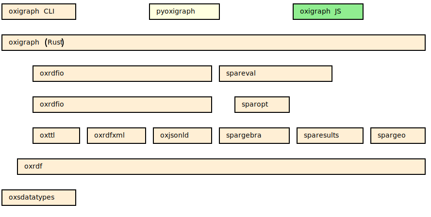

# Oxigraph

Oxigraph is a graph database implementing the [SPARQL](https://www.w3.org/TR/sparql11-overview/) standard.

Its goal is to provide a compliant, safe, and fast graph database based on the [RocksDB](https://rocksdb.org/) key-value store.
It is written in Rust.
It also provides a set of utility functions for reading, writing, and processing RDF files.

Oxigraph is in heavy development and SPARQL query evaluation has not been optimized yet.
The development roadmap is using [GitHub milestones](https://github.com/oxigraph/oxigraph/milestones?direction=desc&sort=completeness&state=open).
Oxigraph internal design [is described on the wiki](https://github.com/oxigraph/oxigraph/wiki/Architecture).

Oxigraph implements the following specifications:

- [SPARQL 1.1 Query](https://www.w3.org/TR/sparql11-query/), [SPARQL 1.1 Update](https://www.w3.org/TR/sparql11-update/), and [SPARQL 1.1 Federated Query](https://www.w3.org/TR/sparql11-federated-query/).
- [Turtle](https://www.w3.org/TR/turtle/), [TriG](https://www.w3.org/TR/trig/), [N-Triples](https://www.w3.org/TR/n-triples/), [N-Quads](https://www.w3.org/TR/n-quads/), and [RDF/XML](https://www.w3.org/TR/rdf-syntax-grammar/) RDF serialization formats for both data ingestion and retrieval.
- [SPARQL Query Results XML Format](https://www.w3.org/TR/rdf-sparql-XMLres/), [SPARQL 1.1 Query Results JSON Format](https://www.w3.org/TR/sparql11-results-json/) and [SPARQL 1.1 Query Results CSV and TSV Formats](https://www.w3.org/TR/sparql11-results-csv-tsv/).

It is split into multiple parts:

- [The database written as a Rust library](./lib/oxigraph). Its source code is in the `lib` directory.
  
  
- [`pyoxigraph` that exposes Oxigraph to the Python world](./python). Its source code is in the `python` directory. 
- [JavaScript bindings for Oxigraph](./js). WebAssembly is used to package Oxigraph into a NodeJS compatible NPM package. Its source code is in the `js` directory.
  
- [Oxigraph binary](./cli) that provides a standalone command-line tool allowing to manipulate RDF data and spawn a a web server implementing the [SPARQL 1.1 Protocol](https://www.w3.org/TR/sparql11-protocol/) and the [SPARQL 1.1 Graph Store Protocol](https://www.w3.org/TR/sparql11-http-rdf-update/). Its source code is in the `cli` directory.
  Note that it was previously named [Oxigraph server](https://crates.io/crates/oxigraph-server).
  

Also, some parts of Oxigraph are available as standalone Rust crates:
* [`oxrdf`](./lib/oxrdf), datastructures encoding RDF basic concepts (the [`oxigraph::model`](crate::model) module).
* [`oxrdfio`](./lib/oxrdfio), a unified parser and serializer API for RDF formats (the [`oxigraph::io`](crate::io) module). It itself relies on:
  * [`oxttl`](./lib/oxttl), N-Triple, N-Quad, Turtle, TriG and N3 parsing and serialization.
  * [`oxrdfxml`](./lib/oxrdfxml), RDF/XML parsing and serialization.
* [`spareval`](./lib/spareval), a SPARQL evaluator.
* [`spargebra`](./lib/spargebra), a SPARQL parser.
* [`sparesults`](./lib/sparesults), parsers and serializers for SPARQL result formats.
* [`sparopt`](./lib/sparopt), a SPARQL optimizer.
* [`oxsdatatypes`](./lib/oxsdatatypes), an implementation of some XML Schema datatypes.

The library layers in Oxigraph. The elements above depend on the elements below:

A preliminary benchmark [is provided](bench/README.md). There is also [a document describing Oxigraph technical architecture](https://github.com/oxigraph/oxigraph/wiki/Architecture).

When cloning this codebase, don't forget to clone the submodules using
`git clone --recursive https://github.com/oxigraph/oxigraph.git` to clone the repository including submodules or
`git submodule update --init` to add the submodules to the already cloned repository.

## Help

Feel free to use [GitHub discussions](https://github.com/oxigraph/oxigraph/discussions) or [the Gitter chat](https://gitter.im/oxigraph/community) to ask questions or talk about Oxigraph.
[Bug reports](https://github.com/oxigraph/oxigraph/issues) are also very welcome.

If you need advanced support or are willing to pay to get some extra features, feel free to reach out to [Tpt](https://github.com/Tpt/).

## License

This project is licensed under either of

- Apache License, Version 2.0, ([LICENSE-APACHE](LICENSE-APACHE) or
  http://www.apache.org/licenses/LICENSE-2.0)
- MIT license ([LICENSE-MIT](LICENSE-MIT) or
  http://opensource.org/licenses/MIT)

at your option.

### Contribution

Unless you explicitly state otherwise, any contribution intentionally submitted for inclusion in Oxigraph by you, as defined in the Apache-2.0 license, shall be dual licensed as above, without any additional terms or conditions.

## Sponsors

* [Zazuko](https://zazuko.com/), a knowledge graph consulting company.
* [RelationLabs](https://relationlabs.ai/) that is building [Relation-Graph](https://github.com/relationlabs/Relation-Graph), a SPARQL database module for the [Substrate blockchain platform](https://substrate.io/) based on Oxigraph.
* [Field 33](https://field33.com) that was building [an ontology management platform](https://plow.pm/).
* [Magnus Bakken](https://github.com/magbak) who is building [Data Treehouse](https://www.data-treehouse.com/), a time-series + RDF datalake platform, and [chrontext](https://github.com/magbak/chrontext), a SPARQL query endpoint on top of joint RDF and time series databases.
* [DeciSym.AI](https://www.decisym.ai/) a cyber security consulting company providing RDF-based software.
* [ACE IoT Solutions](https://aceiotsolutions.com/), a building IOT platform.
* [Albin Larsson](https://byabbe.se/) who is building [GovDirectory](https://www.govdirectory.org/), a directory of public agencies based on Wikidata.

And [others](https://github.com/sponsors/Tpt). Many thanks to them!
