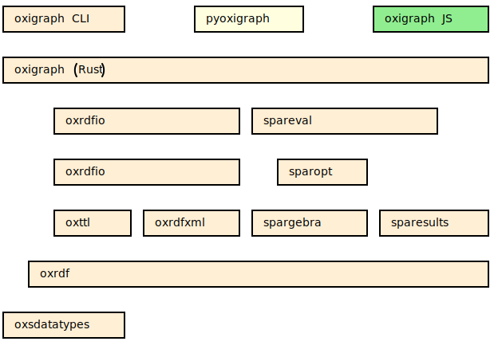

# Oxigraph-handlegraph

[Oxigraph](https://github.com/oxigraph/oxigraph) is a graph database implementing the [SPARQL](https://www.w3.org/TR/sparql11-overview/) standard.

This is a fork of oxigraph that includes [rs-handlegraph](https://github.com/chfi/rs-handlegraph).
The purpose is to make pangenomic GFA-files accessible with SPARQL queries.

Also, some parts of Oxigraph are available as standalone Rust crates:
* [`oxrdf`](https://crates.io/crates/oxrdf), datastructures encoding RDF basic concepts (the [`oxigraph::model`](crate::model) module).
* [`oxrdfio`](https://crates.io/crates/oxrdfio), a unified parser and serializer API for RDF formats (the [`oxigraph::io`](crate::io) module). It itself relies on:
  * [`oxttl`](https://crates.io/crates/oxttl), N-Triple, N-Quad, Turtle, TriG and N3 parsing and serialization.
  * [`oxrdfxml`](https://crates.io/crates/oxrdfxml), RDF/XML parsing and serialization.
* [`spargebra`](https://crates.io/crates/spargebra), a SPARQL parser.
* [`sparesults`](https://crates.io/crates/sparesults), parsers and serializers for SPARQL result formats.
* [`sparopt`](https://crates.io/crates/sparesults), a SPARQL optimizer.
* [`oxsdatatypes`](https://crates.io/crates/oxsdatatypes), an implementation of some XML Schema datatypes.

The library layers in Oxigraph. The elements above depend on the elements below:

When cloning this codebase, don't forget to clone the submodules using
`git clone --recursive https://github.com/oxigraph/oxigraph.git` to clone the repository including submodules or
`git submodule update --init` to add the submodules to the already cloned repository.

## Help

Feel free to ask [heringerp](https://github.com/heringerp) for help.
[Bug reports](https://github.com/heringerp/oxigraph/issues) are also very welcome.

## License

This project is licensed under either of

- Apache License, Version 2.0, ([LICENSE-APACHE](LICENSE-APACHE) or
  http://www.apache.org/licenses/LICENSE-2.0)
- MIT license ([LICENSE-MIT](LICENSE-MIT) or
  http://opensource.org/licenses/MIT)

at your option.

### Contribution

Unless you explicitly state otherwise, any contribution intentionally submitted for inclusion in Oxigraph by you, as defined in the Apache-2.0 license, shall be dual licensed as above, without any additional terms or conditions.
