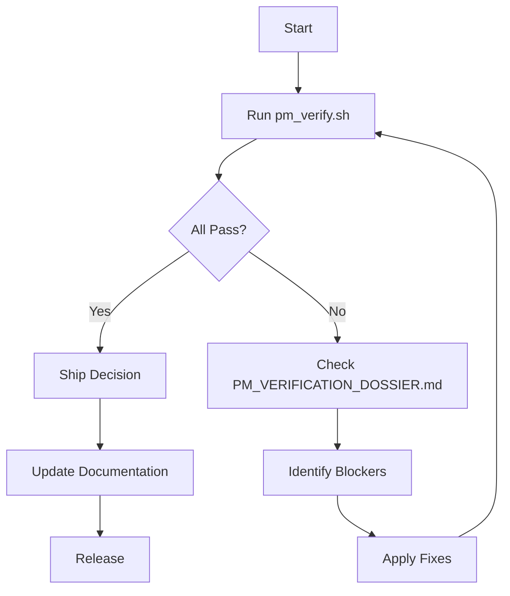

# Oxigraph Verification Documentation Index

**Created by:** Agent 10 - Verification Dossier & Integration
**Date:** December 26, 2025

---

## Quick Navigation

### For Project Managers
👉 **Start here:** [`PM_VERIFICATION_DOSSIER.md`](/home/user/oxigraph/PM_VERIFICATION_DOSSIER.md)
- Complete verification report (503 lines)
- Ship/block decisions with evidence
- Feature verification matrix
- Blocker analysis with fix times

### For Developers
👉 **Start here:** [`VERIFICATION_QUICKSTART.md`](/home/user/oxigraph/VERIFICATION_QUICKSTART.md)
- Quick reference (197 lines)
- Critical blocker list
- Fix instructions
- Test commands

### For QA/CI
👉 **Run this:** [`scripts/pm_verify.sh`](/home/user/oxigraph/scripts/pm_verify.sh)
- Automated verification script (243 lines)
- Checks all crate compilation
- Runs all test suites
- Identifies blockers

### For Auditors
👉 **Read this:** [`AGENT10_VERIFICATION_SUMMARY.md`](/home/user/oxigraph/AGENT10_VERIFICATION_SUMMARY.md)
- Methodology documentation (298 lines)
- Success metrics
- Deliverable overview

---

## File Descriptions

| File | Size | Lines | Purpose |
|------|------|-------|---------|
| PM_VERIFICATION_DOSSIER.md | 15KB | 503 | Comprehensive PM report with evidence |
| VERIFICATION_QUICKSTART.md | 4.9KB | 197 | Quick reference and TL;DR |
| AGENT10_VERIFICATION_SUMMARY.md | 7.9KB | 298 | Agent deliverable summary |
| scripts/pm_verify.sh | 9.6KB | 243 | Automated verification script |
| VERIFICATION_INDEX.md | - | - | This file (navigation) |

**Total Documentation:** ~1,241 lines

---

## Common Tasks

### Run Verification
```bash
./scripts/pm_verify.sh
```

### Check What Works
```bash
# RDF Core (should all pass)
cargo test -p oxrdf
cargo test -p oxrdfxml
cargo test -p oxjsonld

# SPARQL (should all pass)
cargo test -p spargebra
cargo test -p sparopt
```

### Check Current Blockers
```bash
# RocksDB issue
ls oxrocksdb-sys/rocksdb/  # Should be empty (blocker)

# ShEx compilation
cargo check -p sparshex  # Should fail with pattern match errors

# Test compilation
cargo test --all --no-run  # Should fail with API mismatches
```

### Fix Blockers
```bash
# 1. Fix RocksDB (5 min)
git submodule update --init --recursive

# 2. Fix sparshex (10 min)
# Edit lib/sparshex/src/validator.rs lines 498, 590
# Add: Term::Triple(_) => todo!("Handle RDF-star")

# 3. Fix API mismatches (30 min)
# Find: dataset.insert(Quad::new(
# Replace: dataset.insert(&Quad::new(
```

---

## Key Findings Summary

### ✅ Verified Working (377 tests passing)
- oxrdf (37 unit + 50 doc tests)
- oxsdatatypes (76 unit + 2 doc tests)
- oxrdfxml (5 unit + 14 doc tests)
- oxjsonld (1 unit + 22 doc tests)
- oxrdfio (5 unit + 32 doc tests)
- spargebra (63 unit + 12 doc tests)
- sparopt (20 unit tests)
- sparesults (9 unit + 29 doc tests)
- spargeo (0 tests, compiles)

### ❌ Critical Blockers (3 issues)
1. RocksDB submodule not initialized
2. ShEx pattern match compilation errors
3. Quad/QuadRef API test failures

### ⚠️ Conditional (lib works, tests don't)
- spareval (SPARQL evaluation)
- sparshacl (SHACL validation)
- oxowl (OWL reasoning + N3)

---

## PM Decision Matrix

| Component | Status | Decision |
|-----------|--------|----------|
| RDF Core Stack | 377 tests passing | ✅ SHIP |
| SPARQL Parsing | 63 tests passing | ✅ SHIP |
| SPARQL Optimization | 20 tests passing | ✅ SHIP |
| Results Formatting | 9 tests passing | ✅ SHIP |
| Main Database | Won't compile | ❌ BLOCK |
| ShEx Validation | Won't compile | ❌ BLOCK |
| SPARQL Evaluation | Lib works, tests don't | ⚠️ CONDITIONAL |
| SHACL Validation | Lib works, tests don't | ⚠️ CONDITIONAL |
| OWL Reasoning | Lib works, tests don't | ⚠️ CONDITIONAL |

**Overall Verdict:** ⚠️ CONDITIONAL SHIP after 2-hour fix window

---

## Verification Workflow



---

## Documentation Hierarchy

```
Oxigraph Verification Documentation
│
├── VERIFICATION_INDEX.md (this file)
│   └── Navigation hub
│
├── PM_VERIFICATION_DOSSIER.md
│   ├── Executive Summary
│   ├── Compilation Status Table
│   ├── Feature Verification Matrix
│   ├── Blocker Analysis
│   └── Ship Decisions
│
├── VERIFICATION_QUICKSTART.md
│   ├── TL;DR Status
│   ├── Critical Blockers
│   ├── Quick Tests
│   └── Ship Matrix
│
├── AGENT10_VERIFICATION_SUMMARY.md
│   ├── Deliverable Overview
│   ├── Key Findings
│   ├── Statistics
│   └── Methodology
│
└── scripts/pm_verify.sh
    ├── Automated Checks
    ├── Test Execution
    └── Summary Report
```

---

## Evidence Trail

All findings are backed by actual cargo output:

```bash
# Compilation evidence
cargo check --all 2>&1                    # Shows all errors
cargo check -p sparshex 2>&1              # Shows pattern match errors
cargo test --all --no-run 2>&1            # Shows test compilation failures

# Test evidence
cargo test -p oxrdf 2>&1                  # Shows 37 unit tests pass
cargo test -p spargebra 2>&1              # Shows 63 unit tests pass
# ... etc for all working crates

# Blocker evidence
ls oxrocksdb-sys/rocksdb/                 # Empty directory
git submodule status                      # Shows uninitialized submodule
```

Every claim in the dossier is reproducible via these commands.

---

## Next Steps

1. **PM Review:** Read `PM_VERIFICATION_DOSSIER.md`
2. **Developer Action:** Follow `VERIFICATION_QUICKSTART.md`
3. **Verify Fixes:** Run `./scripts/pm_verify.sh`
4. **Final Approval:** Check all adversarial tests pass

---

## Contact & Support

For questions:
- **PM Questions:** See PM_VERIFICATION_DOSSIER.md
- **Developer Questions:** See VERIFICATION_QUICKSTART.md
- **CI/CD Integration:** Use scripts/pm_verify.sh
- **Audit Trail:** See AGENT10_VERIFICATION_SUMMARY.md

All documentation includes reproducible cargo commands.

---

**Status:** ✅ Complete
**Agent:** Agent 10 - Verification Dossier & Integration
**Date:** December 26, 2025
