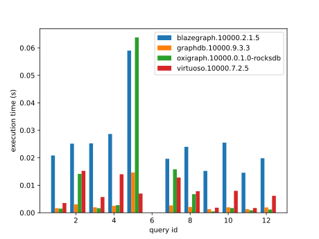
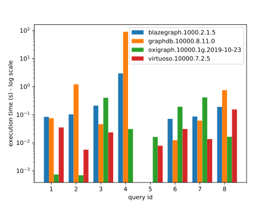

BSBM
====

The [Berlin SPARQL Benchmark (BSBM)](http://wifo5-03.informatik.uni-mannheim.de/bizer/berlinsparqlbenchmark/) is a simple SPARQL benchmark.

It provides a dataset generator and multiple set of queries grouped by "use cases".

## Results

We compare here Oxigraph with some existing SPARQL implementations (Blazegraph, Virtuoso and GraphDB).

The dataset used in the following charts is generated with 10k "products" (see [its spec](http://wifo5-03.informatik.uni-mannheim.de/bizer/berlinsparqlbenchmark/spec/Dataset/index.html)). It leads to the creation of 3.5M triples.
It has been executed on a PrevailPro P3000 with 32GB of RAM.

### Explore
The [explore use case](http://wifo5-03.informatik.uni-mannheim.de/bizer/berlinsparqlbenchmark/spec/ExploreUseCase/index.html) is composed of 11 queries that do simple data retrieval.

Query 6 existed in previous versions of the benchmark as is now removed.

<!--
### Business Intelligence
The [business intelligence use case](http://wifo5-03.informatik.uni-mannheim.de/bizer/berlinsparqlbenchmark/spec/BusinessIntelligenceUseCase/index.html) is composed of 8 complex analytics queries.

Query 4 seems to be failing on Virtuoso and query 5 on Blazegraph and GraphDB.

Oxigraph is still too slow to evaluate most of the queries.
It will be added in the graph after enough optimizations are done.

-->

## How to reproduce the benchmark

The code of the benchmark is in the `bsbm-tools` submodule. You should pull it with a `git submodule update` before running the benchmark.

To run the benchmark for Oxigraph run `bash bsbm_oxigraph.sh`. It will compile the current Oxigraph code and run the benchmark against it.
You could tweak the number of products in the dataset using the environment variables at the beginning of `bsbm_oxigraph.sh`.

To generate the plots run `python3 bsbsm-plot.py`.

Scripts are also provided for the other benchmarks (`bsbm_blazegraph.sh`, `bsbm_graphdb.sh` and `bsbm_virtuoso.sh`).