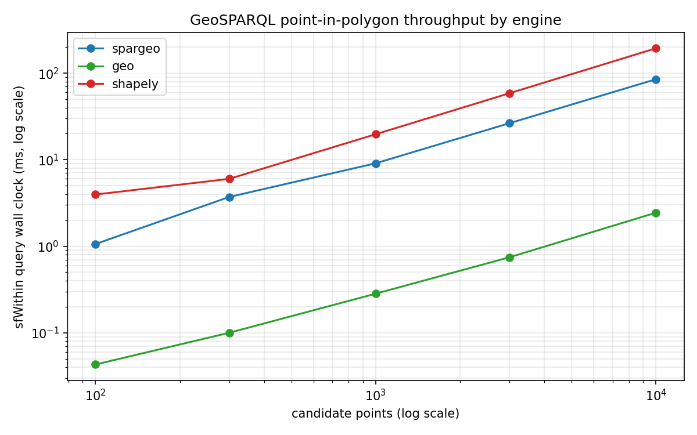

spargeo benchmark
=================

This benchmark measures GeoSPARQL point-in-polygon throughput on
synthetic CRS84 data, comparing `spargeo` against the raw `geo` crate
(Rust lower bound) and `shapely` (Python reference).



Workload
--------

* Fixture: 10 query polygons scattered across a CRS84 bounding box plus
  `N` candidate points sampled uniformly inside the same box. Polygons
  are sized so a few percent of points fall inside, forcing every engine
  to run the actual topology test rather than short circuiting on
  bounding boxes.
* Operation: for each polygon, test every point with `sfWithin`. Total
  ops per run = `10 * N`.
* Report: `parse_ms` (load the Turtle fixture and build the engine's
  native geometry representation) and `query_ms` (run the full
  polygon-by-point loop). Only `query_ms` is plotted; `parse_ms` is
  reported so you can see what each stack pays before the first relate
  call.

Engines
-------

* `spargeo`: calls `geof:sfWithin` through the public
  `GEOSPARQL_EXTENSION_FUNCTIONS` table the SPARQL evaluator wires in.
  Each call reparses the WKT literal, matching how the engine actually
  invokes the function in a query. This is the realistic cost seen by
  `FILTER(geof:sfWithin(?p, ?q))` today.
* `geo`: calls `geo::Relate::relate(...).is_within()` directly on WKT
  strings parsed once up front. No SPARQL literal wrapping, no per-call
  reparse. Serves as the Rust lower bound that spargeo could approach
  if literal parsing were amortised. The architectural work proposed in
  oxigraph issue #1560 (WKB-backed literals plus an S2 cell index)
  moves in this direction.
* `shapely`: Python reference. Parses every WKT once via
  `shapely.wkt.loads` into native geometry objects, then iterates
  `polygon.contains(point)` in a tight loop. Pure Python overhead shows
  up as a near constant per-call cost on top of the native GEOS call.

All three engines read the same Turtle fixture and agree on the `matches`
count at every size.

Results
-------

Median `query_ms` on a 2023 MacBook Pro (M-series), 3 repeats per cell,
10 polygons per fixture:

| points | spargeo | geo     | shapely |
|-------:|--------:|--------:|--------:|
|    100 |   1.1   |  0.04   |   4.0   |
|    300 |   3.7   |  0.10   |   6.0   |
|  1 000 |   9.1   |  0.28   |  19.7   |
|  3 000 |  26.4   |  0.75   |  58.6   |
| 10 000 |  85.0   |  2.44   | 193.8   |

Observations:

* All three engines scale linearly with the number of candidate points.
  The log-log plot above shows three parallel lines.
* `spargeo` runs about 2x faster than `shapely` at every size, even
  though both pay a per-call geometry construction cost. The Python
  interpreter overhead dominates shapely's per-pair time; spargeo's
  per-call WKT reparse is cheaper than a Python method dispatch plus
  C boundary crossing.
* `spargeo` runs about 35x slower than the raw `geo` baseline at
  10 000 points (85 ms vs 2.4 ms). That gap is the literal parse tax:
  every `geof:sfWithin` call receives two WKT strings and reparses them
  into `geo::Geometry` before calling the exact same `relate` kernel.
* The gap is roughly flat across sizes, which identifies it as a
  per-call constant rather than algorithmic overhead. Closing it
  requires either a storage level change (WKB-backed literals from
  oxigraph issue #1560) or a query planner change that hoists
  geometry construction out of the filter call.

Layout
------

* `generate_geodata.py`: Turtle fixture generator. Emits
  `geo:hasGeometry` plus `geo:asWKT` for every feature (polygon and
  point) using CRS84 `wktLiteral` values. Fully deterministic given
  `--seed`.
* `native/`: Rust bench binary (`spargeo_bench`). Subprocessed once per
  `(engine, size, repeat)` cell. Prints a single JSON line on stdout.
* `bench.py`: Python driver. Iterates sizes and repeats, drives the
  Rust binary for `spargeo` and `geo`, runs `shapely` in process,
  aggregates to CSV / JSON, and plots median `query_ms` across sizes
  on a log-log axis.
* `out/`: committed outputs from the last run.
  `out/data/` is gitignored; the CSV, JSON, and PNG are kept in tree.

Running
-------

Build the Rust bench binary once:

```
cargo build --release --manifest-path bench/geosparql/native/Cargo.toml
```

Install the Python dependency for the `shapely` engine (optional; skip
if only comparing the two Rust engines):

```
pip install shapely matplotlib
```

Run the benchmark across the default size ladder:

```
python bench/geosparql/bench.py \
    --sizes 100 300 1000 3000 10000 30000 \
    --repeats 3 \
    --output-dir bench/geosparql/out
```

Outputs land in `bench/geosparql/out/`:

* `data/geo_<N>.ttl` for each fixture size
* `results.csv`: one row per `(engine, size, repeat)`
* `summary.json`: median / min / max `query_ms` per `(engine, size)`
* `geosparql_comparison.png`: log-log plot of median `query_ms` by engine

Pass `--only spargeo geo` to skip shapely, or `--only spargeo` to
profile spargeo alone.

Interpreting the gap
--------------------

The `spargeo` vs `geo` gap at a given size is the tax paid for parsing
the WKT literal on every extension function call. That tax scales
linearly with `query_ms` for large `N`, since both engines spend their
time inside `geo::Relate`. Closing the gap requires one of:

* A storage level change that keeps geometries parsed (oxigraph
  issue #1560's WKB literal proposal).
* A query planner change that lifts geometry construction out of the
  extension function loop (pre-materialise every `geo:asWKT` literal
  into a parsed geometry at bind time).

Neither belongs inside `spargeo` itself; both belong in the oxigraph
evaluator. This benchmark is the lever that makes the case for that
work concrete.

The `shapely` line is reported for ecosystem context: it shows the cost
of the same workload in a Python GEOS stack. Python call overhead
dominates per pair at every size in our range, so shapely never catches
up to the native `geo` baseline.

Competing GeoSPARQL implementations
-----------------------------------

This harness intentionally stays Rust-first and single-language, for the
same reasons the reasoner benchmark does. Comparing against full
GeoSPARQL engines in other languages (Apache Jena, RDF4J, GraphDB,
QLever) requires spinning up a server process and round tripping SPARQL
queries over HTTP or a JNI bridge, which introduces overheads unrelated
to the topology kernel. Those comparisons belong in a separate harness.
The present benchmark answers a narrower question: how close can
`spargeo` get to the Rust ceiling on the same machine?

JSON contract from the native bench binary
------------------------------------------

The Rust binary at `native/src/main.rs` takes two positional arguments,
`<engine>` and `<path-to-turtle>`, and prints a single JSON line to
stdout:

```json
{"engine":"spargeo","parse_ms":12.3,"query_ms":45.6,"points":10000,"polygons":10,"matches":221}
```

`engine` is one of `spargeo` or `geo`. `matches` is the number of
(polygon, point) pairs for which `sfWithin` evaluated true; all
engines must report the same count on a given fixture.
