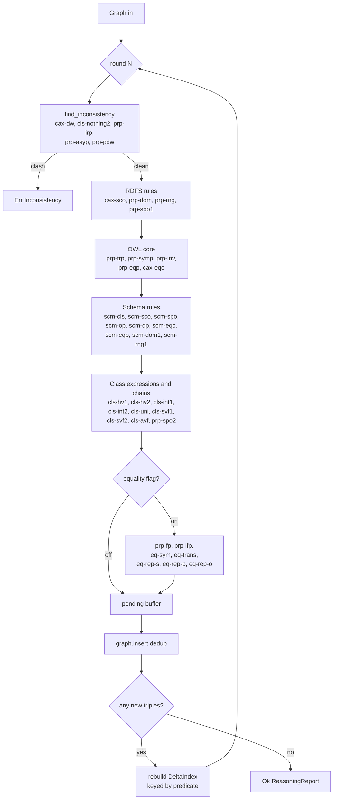
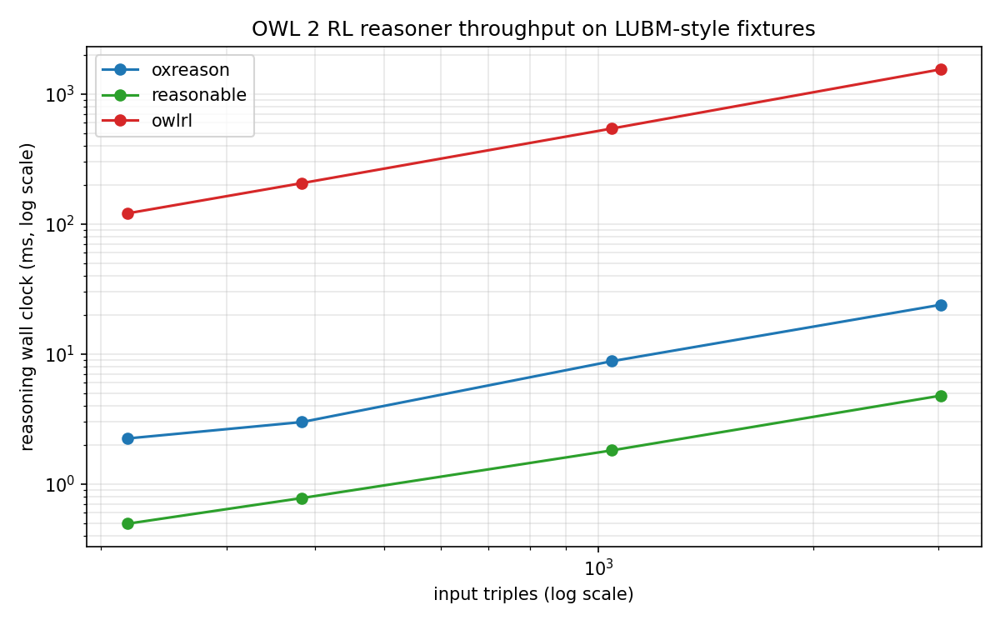

oxreason
========

OWL 2 RL reasoning and SHACL validation for [Oxigraph](https://oxigraph.org/).

Status: OWL 2 RL forward chainer with 39 inference rules wired in,
semi-naive evaluation, and five inconsistency detectors. SHACL validator is
scaffolded with `sh:minCount` landed. See `DESIGN.md` for the milestone
plan and `TESTING.md` for the per rule integration test layout under
`tests/`.

Tracks [oxigraph issue #130](https://github.com/oxigraph/oxigraph/issues/130).

Quick API shape
---------------

```rust
use oxrdf::Graph;
use oxreason::{Reasoner, ReasonerConfig};

let config = ReasonerConfig::owl2_rl();
let reasoner = Reasoner::new(config);

let mut graph = Graph::default();
// ... load triples into graph ...

match reasoner.expand(&mut graph) {
    Ok(report) => println!("inferred {} triples", report.added),
    Err(err) => eprintln!("reasoning failed: {err}"),
}
```

OWL 2 RL rule coverage
----------------------

Rule names and grouping follow the W3C OWL 2 Profiles spec, section 4.3.1
"Reasoning in OWL 2 RL and RDF Graphs using Rules".

Status legend:

| Symbol | Meaning |
|--------|---------|
| on | Implemented, runs on every `expand` call under `owl2_rl` profile |
| rdfs | Implemented, also runs under `rdfs` profile |
| equality | Implemented, gated behind `ReasonerConfig::with_equality_rules` |
| inconsistency | Implemented as a detector that aborts `expand` with `ReasonError::Inconsistent` |
| pending | Not yet implemented |

### Class axioms

| Rule | Status | Notes |
|------|--------|-------|
| cax-sco | rdfs | subclass propagates `rdf:type` |
| cax-eqc1 | on | equivalentClass implies subclass in one direction |
| cax-eqc2 | on | equivalentClass implies subclass in the other direction |
| cax-dw | inconsistency | disjointWith pair clashes |
| cax-adc | pending | allDisjointClasses |

### Property axioms

| Rule | Status | Notes |
|------|--------|-------|
| prp-dom | rdfs | rdfs:domain types subjects |
| prp-rng | rdfs | rdfs:range types objects |
| prp-spo1 | rdfs | subPropertyOf propagates edges |
| prp-spo2 | on | propertyChainAxiom of arbitrary length |
| prp-trp | on | TransitiveProperty closure |
| prp-symp | on | SymmetricProperty flip |
| prp-inv1 | on | inverseOf forward direction |
| prp-inv2 | on | inverseOf reverse direction |
| prp-eqp1 | on | equivalentProperty forward |
| prp-eqp2 | on | equivalentProperty reverse |
| prp-fp | equality | FunctionalProperty yields `owl:sameAs` |
| prp-ifp | equality | InverseFunctionalProperty yields `owl:sameAs` |
| prp-irp | inconsistency | IrreflexiveProperty reflexive edge |
| prp-asyp | inconsistency | AsymmetricProperty reciprocal edge |
| prp-pdw | inconsistency | propertyDisjointWith pair clashes |
| prp-ap | pending | AnnotationProperty introduction |
| prp-key | pending | hasKey |
| prp-npa1 | pending | NegativePropertyAssertion subject |
| prp-npa2 | pending | NegativePropertyAssertion target value |
| prp-adp | pending | AllDisjointProperties |

### Class expressions

| Rule | Status | Notes |
|------|--------|-------|
| cls-hv1 | on | hasValue propagates property |
| cls-hv2 | on | hasValue infers class membership |
| cls-int1 | on | intersectionOf combines types |
| cls-int2 | on | intersectionOf splits membership |
| cls-uni | on | unionOf admits any member |
| cls-svf1 | on | someValuesFrom with typed filler |
| cls-svf2 | on | someValuesFrom with owl:Thing filler |
| cls-avf | on | allValuesFrom propagates filler type |
| cls-nothing2 | inconsistency | any instance of owl:Nothing |
| cls-thing | pending | owl:Thing membership |
| cls-nothing1 | pending | owl:Nothing type assertion |
| cls-com | pending | complementOf |
| cls-maxc1 | pending | maxCardinality 0 |
| cls-maxc2 | pending | maxCardinality 1 derives `owl:sameAs` |
| cls-maxqc1 | pending | maxQualifiedCardinality 0 with owl:Thing filler |
| cls-maxqc2 | pending | maxQualifiedCardinality 0 with named filler |
| cls-maxqc3 | pending | maxQualifiedCardinality 1 with owl:Thing filler |
| cls-maxqc4 | pending | maxQualifiedCardinality 1 with named filler |
| cls-oo | pending | oneOf |

### Schema axioms

| Rule | Status | Notes |
|------|--------|-------|
| scm-cls | on | reflexive subClassOf and owl:Thing bounds |
| scm-sco | on | subClassOf transitivity |
| scm-spo | on | subPropertyOf transitivity |
| scm-op | on | ObjectProperty reflexive subPropertyOf |
| scm-dp | on | DatatypeProperty reflexive subPropertyOf |
| scm-eqc1 | on | equivalentClass splits |
| scm-eqc2 | on | two-way subClassOf joins equivalentClass |
| scm-eqp1 | on | equivalentProperty splits |
| scm-eqp2 | on | two-way subPropertyOf joins equivalentProperty |
| scm-dom1 | on | domain propagates up subClassOf |
| scm-rng1 | on | range propagates up subClassOf |
| scm-dom2 | pending | domain propagates up subPropertyOf |
| scm-rng2 | pending | range propagates up subPropertyOf |
| scm-hv | pending | hasValue schema closure |
| scm-svf1 | pending | someValuesFrom schema closure on filler |
| scm-svf2 | pending | someValuesFrom schema closure on property |
| scm-avf1 | pending | allValuesFrom schema closure on filler |
| scm-avf2 | pending | allValuesFrom schema closure on property |
| scm-int | pending | intersectionOf schema closure |
| scm-uni | pending | unionOf schema closure |

### Equality

| Rule | Status | Notes |
|------|--------|-------|
| eq-sym | equality | `owl:sameAs` symmetry |
| eq-trans | equality | `owl:sameAs` transitivity |
| eq-rep-s | equality | `owl:sameAs` substitution in subject |
| eq-rep-p | equality | `owl:sameAs` substitution in predicate |
| eq-rep-o | equality | `owl:sameAs` substitution in object |
| eq-ref | pending | `owl:sameAs` reflexivity |
| eq-diff1 | pending | `owl:differentFrom` clash |
| eq-diff2 | pending | AllDifferent clash |
| eq-diff3 | pending | AllDifferent members |

### Datatypes

| Rule | Status | Notes |
|------|--------|-------|
| dt-type1 | pending | typed literal rdf:type |
| dt-type2 | pending | literal rdf:type from range |
| dt-eq | pending | literal equality in value space |
| dt-diff | pending | literal distinctness in value space |
| dt-not-type | pending | literal outside datatype lexical space |

Engine pipeline
---------------

Forward chaining runs a semi-naive fixpoint. Round 1 scans the full graph;
every subsequent round joins each rule against the `DeltaIndex` built from
triples added in the previous round. Inconsistency detectors run first so
the engine fails fast on bad input.



Benchmarks
----------

A LUBM-style synthetic benchmark comparing `oxreason`, `reasonable`, and
`owlrl` sits in `bench/reasoner`. See its README for how to run it and
where results land.

Reasoning time, best of 3 runs, macOS ARM, 2026-04-20. `oxreason` is the
current fork with interning and Arc-backed term internals. `reasonable` is
the baseline Rust crate. Ratio is `oxreason / reasonable`.

| Dataset    | oxreason (ms) | reasonable (ms) | Ratio |
|------------|---------------|-----------------|-------|
| LUBM 100   | 2.07          | 0.53            | 3.9x  |
| LUBM 300   | 2.42          | 0.78            | 3.1x  |
| LUBM 1000  | 6.73          | 1.74            | 3.9x  |
| LUBM 3000  | 21.16         | 4.82            | 4.4x  |

The remaining gap is dominated by `graph.insert` in oxrdf, which walks six
`BTreeSet` indexes per novel triple. The reference reasoner uses a flat
hash-indexed store. Closing the gap requires either switching oxrdf's
dataset to a hash-indexed representation or routing reasoner rule bodies
through the interner so hot-path lookups compare `u32` ids rather than
IRI strings.



SHACL coverage
--------------

Implemented: `sh:minCount`.

Not yet implemented: `sh:maxCount`, `sh:class`, `sh:datatype`, `sh:nodeKind`,
`sh:minLength`, `sh:maxLength`, `sh:pattern`, `sh:in`, `sh:hasValue`,
`sh:equals`, `sh:disjoint`, `sh:lessThan`, `sh:lessThanOrEquals`,
`sh:minInclusive`, `sh:maxInclusive`, `sh:minExclusive`, `sh:maxExclusive`,
`sh:node`, `sh:property`, `sh:qualifiedValueShape`, `sh:and`, `sh:or`,
`sh:not`, `sh:xone`, `sh:closed`, SPARQL-based constraints.

License
-------

Dual licensed under MIT or Apache 2.0, matching the rest of the Oxigraph
workspace.
