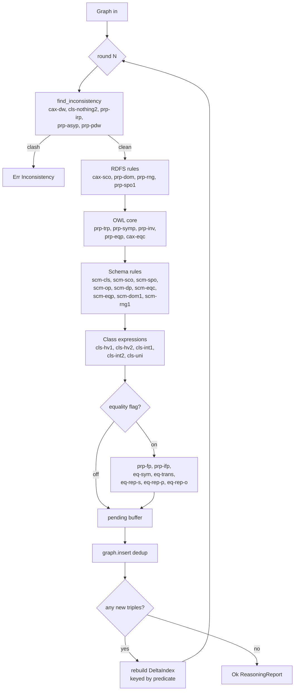

oxreason
========

OWL 2 RL reasoning and SHACL validation for [Oxigraph](https://oxigraph.org/).

Status: OWL 2 RL forward chainer with 35 rules wired in, semi-naive
evaluation, and five inconsistency detectors. SHACL validator is scaffolded
with `sh:minCount` landed. See `DESIGN.md` for the milestone plan and
`TESTING.md` for the per rule integration test layout under `tests/`.

Tracks [oxigraph issue #130](https://github.com/oxigraph/oxigraph/issues/130).

Quick API shape
---------------

```rust
use oxrdf::Graph;
use oxreason::{Reasoner, ReasonerConfig};

let config = ReasonerConfig::owl2_rl();
let reasoner = Reasoner::new(config);

let mut graph = Graph::default();
// ... load triples into graph ...

match reasoner.expand(&mut graph) {
    Ok(report) => println!("inferred {} triples", report.added),
    Err(err) => eprintln!("reasoning failed: {err}"),
}
```

OWL 2 RL rule coverage
----------------------

Numbering follows the W3C OWL 2 Profiles spec, section 4.3.1
"Reasoning in OWL 2 RL and RDF Graphs using Rules".

Implemented and always on:

Class axioms: cax-sco, cax-eqc1, cax-eqc2.
Property axioms: prp-dom, prp-rng, prp-spo1, prp-trp, prp-symp, prp-inv1,
prp-inv2, prp-eqp1, prp-eqp2.
Class expressions: cls-hv1, cls-hv2, cls-int1, cls-int2, cls-uni.
Schema axioms: scm-cls, scm-sco, scm-spo, scm-op, scm-dp, scm-eqc1,
scm-eqc2, scm-eqp1, scm-eqp2, scm-dom1, scm-rng1.

Implemented behind the `with_equality_rules` flag on `ReasonerConfig`
(off by default because these expand noisy data aggressively):
eq-sym, eq-trans, eq-rep-s, eq-rep-p, eq-rep-o, prp-fp, prp-ifp.

Inconsistency detectors (abort `expand` with a structured error):
cax-dw, cls-nothing2, prp-irp, prp-asyp, prp-pdw.

Not yet implemented:

Equality: eq-ref, eq-diff1, eq-diff2, eq-diff3.

Property axioms: prp-ap, prp-spo2 (subPropertyChain), prp-key, prp-npa1,
prp-npa2, prp-adp.

Class expressions: cls-thing, cls-nothing1, cls-com, cls-svf1, cls-svf2,
cls-avf, cls-maxc1, cls-maxc2, cls-maxqc1, cls-maxqc2, cls-maxqc3,
cls-maxqc4, cls-oo.

Class axioms: cax-adc (allDisjointClasses).

Schema axioms: scm-dom2, scm-rng2, scm-hv, scm-svf1, scm-svf2, scm-avf1,
scm-avf2, scm-int, scm-uni.

Datatypes: dt-type1, dt-type2, dt-eq, dt-diff, dt-not-type.

Engine pipeline
---------------

Forward chaining runs a semi-naive fixpoint. Round 1 scans the full graph;
every subsequent round joins each rule against the `DeltaIndex` built from
triples added in the previous round. Inconsistency detectors run first so
the engine fails fast on bad input.



Benchmarks
----------

A LUBM-style synthetic benchmark comparing `oxreason`, `reasonable`, and
`owlrl` sits in `bench/reasoner`. See its README for how to run it and
where results land.


SHACL coverage
--------------

Implemented: `sh:minCount`.

Not yet implemented: `sh:maxCount`, `sh:class`, `sh:datatype`, `sh:nodeKind`,
`sh:minLength`, `sh:maxLength`, `sh:pattern`, `sh:in`, `sh:hasValue`,
`sh:equals`, `sh:disjoint`, `sh:lessThan`, `sh:lessThanOrEquals`,
`sh:minInclusive`, `sh:maxInclusive`, `sh:minExclusive`, `sh:maxExclusive`,
`sh:node`, `sh:property`, `sh:qualifiedValueShape`, `sh:and`, `sh:or`,
`sh:not`, `sh:xone`, `sh:closed`, SPARQL-based constraints.

License
-------

Dual licensed under MIT or Apache 2.0, matching the rest of the Oxigraph
workspace.
